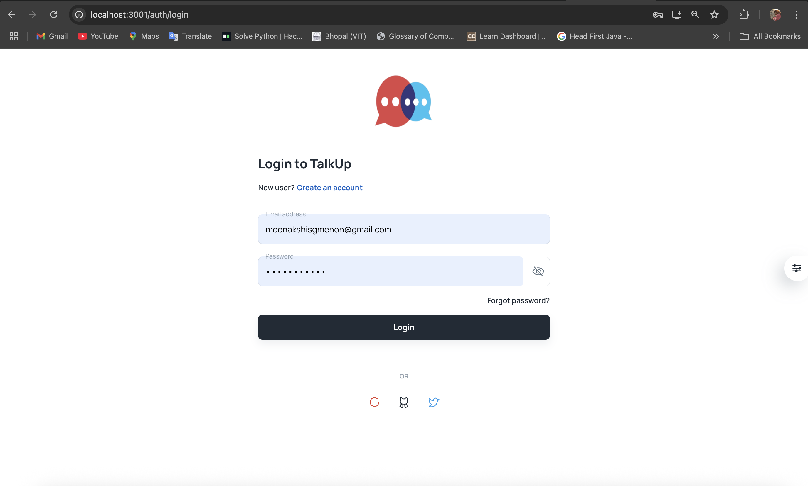
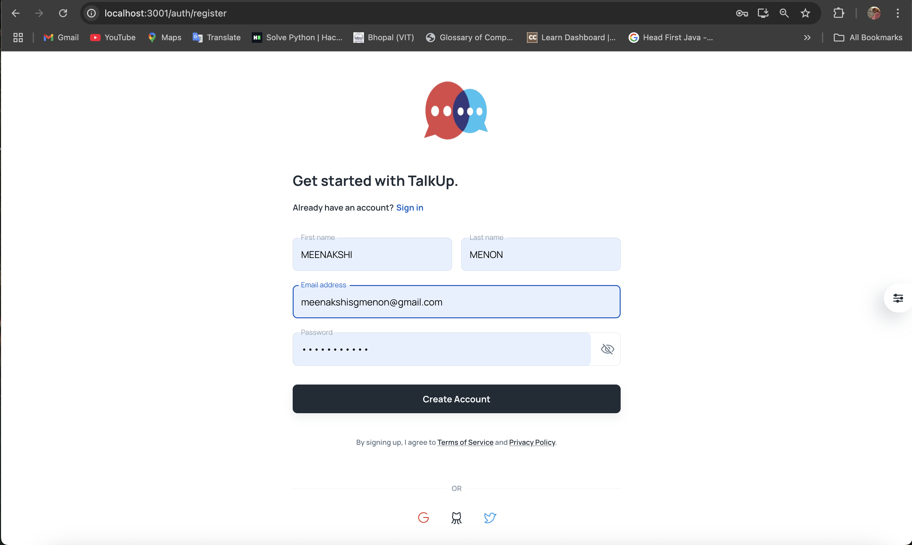
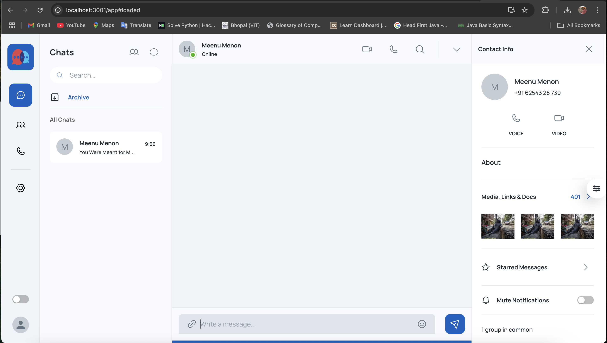
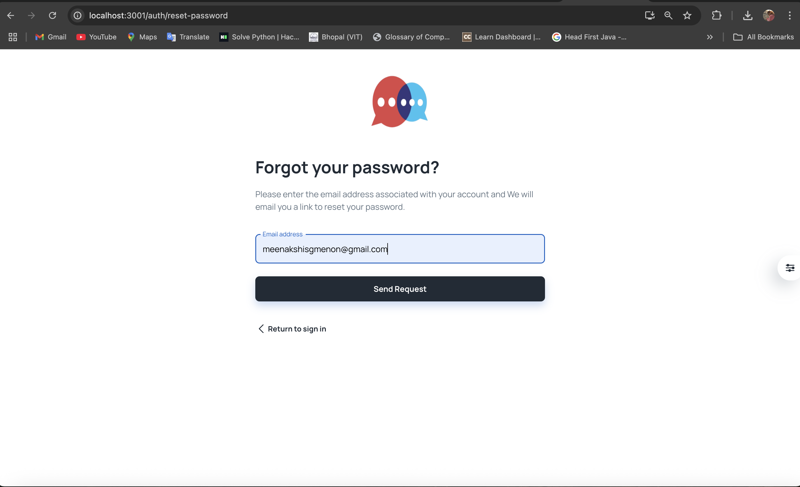
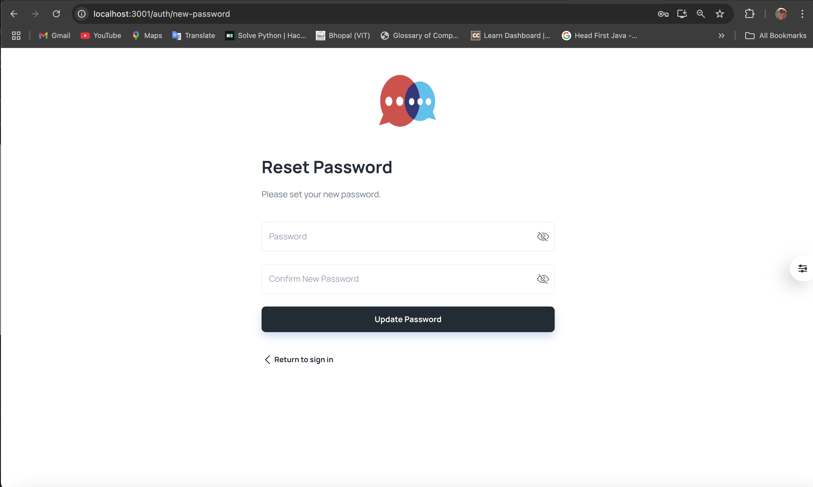
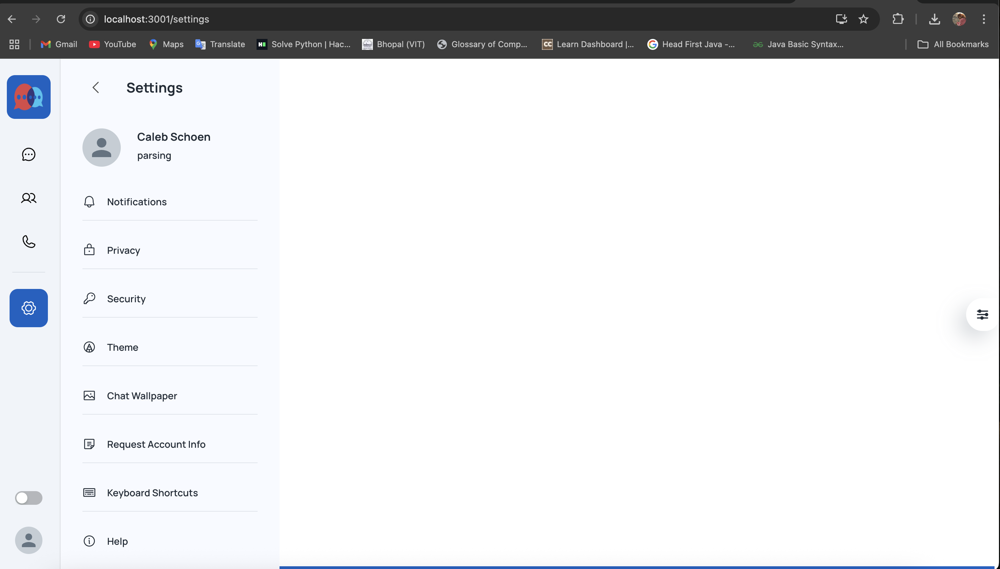
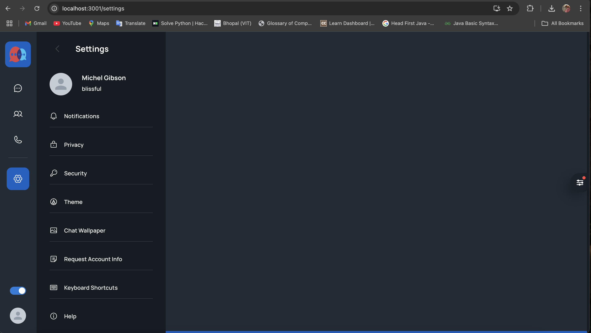

# 💬 TalkUp - Real-Time Chat Application

**TalkUp** is a full-stack real-time chat application designed to enable seamless communication with instant messaging, secure authentication, and a clean, responsive UI. Built with React, Node.js, Express.js, MongoDB, and Socket.IO, it ensures fast, bi-directional communication between users.

## 🚀 Features

- 🔐 User Registration & Login (with secure authentication)
- 💬 Real-Time Messaging using WebSockets (Socket.IO)
- 📦 Persistent Chat History with MongoDB
- 🧩 RESTful APIs for User & Message Handling
- 📱 Responsive Frontend with Tailwind CSS

## 🛠️ Tech Stack

| Frontend       | Backend        | Real-Time         | Database  | Others                  |
|----------------|----------------|-------------------|-----------|--------------------------|
| React          | Node.js        | Socket.IO         | MongoDB   | Tailwind CSS, Express.js |
| Axios          | Express        | WebSockets        | Mongoose  | REST APIs, Postman       |

## 🧪 Getting Started

1. Clone the repo:
   ```bash
   git clone https://github.com/Meenakshi-Menon/TalkUp-FrontEnd-.git
   cd talkup
   ```

2. Install dependencies:
   ```bash
   npm install
   ```

3. Start the development server:
   ```bash
   npm start
   ```

4. Open your browser at:
   ```
   http://localhost:3001
   ```

## 📄 Project Report

[📘 View Full Project Report (PDF)](./report/TalkUp_Project_Report.pdf)


## 🖼️ User Interface Overview

### 🔐 Login Page
Users can securely log in using their credentials to access the chat platform.


---

### 🧾 New User Registration
New users can register via a simple and secure sign-up form.


---

### 💬 Chat Interface
The core real-time chat screen with message history and dynamic interaction.


---

### 🔑 Forgot & Reset Password
Users can recover their accounts using the "Forgot Password" feature, which sends a verification link via email. Once verified, they can reset their password securely.




---

### ⚙️ Settings Panel
Users can manage their profile and preferences through the settings menu.


---

### 🎨 Theme Customization
Users can switch between light and dark modes to personalize their UI experience.


---


## 🙋‍♀️ About the Developer

I’m **Meenakshi S Menon**, a final-year CSE (AI/ML) student at VIT Bhopal, passionate about building intelligent, scalable web applications. This project reflects my interest in real-time systems and full-stack development.

- 🔗 [LinkedIn](https://www.linkedin.com/in/meenakshi-menon-368211252/)
- 💻 [GitHub](https://github.com/Meenakshi-Menon)
- 📧 meenakshisgmenon@gmail.com

## 📌 License

This project is open source and available under the [MIT License](LICENSE).
